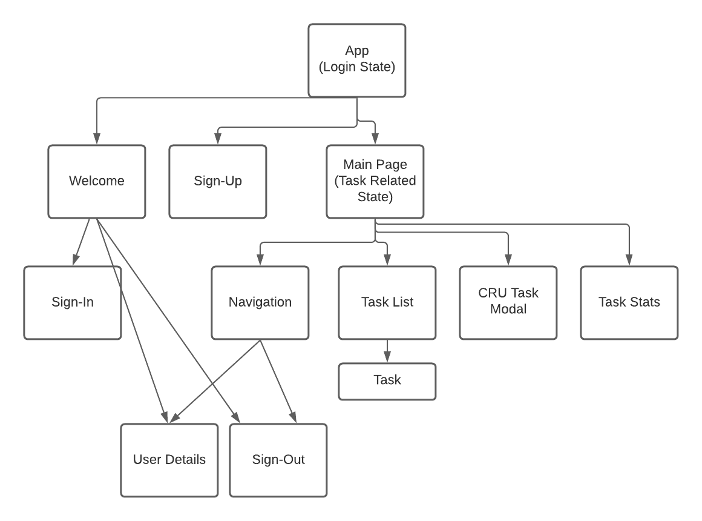
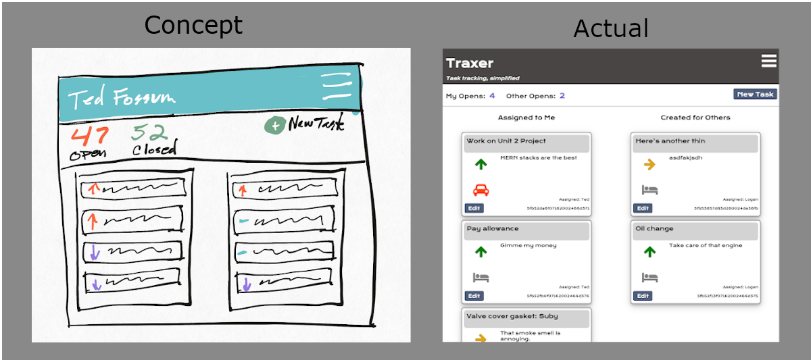

# Traxer, a multi-tenant task list

### By: Ted Fossum
[LinkedIn](https://www.linkedin.com/in/tedfossum/)
***
### Demo App
A demo version of Traxer can be found here:
https://traxer-01.herokuapp.com/

### Overview
This product (Traxer) is a multi-tenant task list tool. With an emphasis on simplicity, users can create and assign tasks to their colleagues within a clean, simple, web interface.
***

### Technologies
* Node.js
* Express
* REACT
* MongoDB
* Mongoose
* HTML/CSS/JavaScript
* Deployed on Heroku
***
## Instalation
### Node.js/MongoDB
Traxer expects Node.js and MongoDB to already be installed.
For Node.js instructions:
https://nodejs.org/en/download/

For MongoDB instructions:
https://www.mongodb.com

***
## Entity Relationships

***
## Component Diagram

***

## Wireframes: Concepts vs. Implementations
Wireframes were developed through low-investment sketches in Concept on iPad.
**Landing Page**

**Sign Up Page**

**Main Page**

**Menu**

**Task Edit**

***

### Trello Board
[Go here for the project Trello board](https://trello.com/b/9DC9kJnL/multi-tenant-task-list)
***

